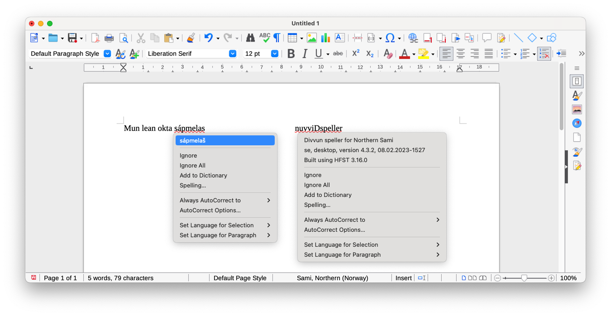

# LibreOffice extension listing data

Title:
  > Divvun speller

Short summary:
> Speller extension for all languages provided by the [Divvun](https://divvun.no) and [Giellatekno](https://giellatekno.uit.no) groups at the [UiT The Arctic University of Norway](https://uit.no). The actual speller for a language is installed using the Divvun Manager, downloadable from the Divvun site.

Project logo:
> 

Matching Tags:
> Writer Calc Education Presentations

Description:
> Speller extension for all languages provided by the [Divvun](https://divvun.no) and [Giellatekno](https://giellatekno.uit.no) groups at the [UiT The Arctic University of Norway](https://uit.no). The actual speller for a language is installed using the Divvun Manager, downloadable from the Divvun site.
> 
> This extension is only for macOS. LibreOffice users on Windows will get automatic support when installing their language components using Divvun Manager.
>  
> The Divvun and Giellatekno groups develop language technology tools for indigenous and minority languages in the Nordic countries and worldwide. Presently there are models and grammar for about 140 different languages in our infrastructure.
>  
> All our languages are supported as speller languages on Windows, macOS and Linux, both in MS Office, LibreOffice and through system speller services. The main mode of installation is through the Divvun Manager app (for Windows and macOS).
>  
> Other tools available from the two groups are:
> - grammar checkers
> - electronic dictionaries
> - machine translation
> - speech synthesis
> - translation memories
> - keyboards with built-in spellers for Android and iOS
> - keyboards for Windows, macOS, Linux and ChromeOS
> - language learning tools
> 
> More information can be found at [giellalt.github.io](https://giellalt.github.io/).

URL of the Extension Homepage:
> <https://github.com/divvun/divvunspell-libreoffice>

URL to the repository's source:
> <https://github.com/divvun/divvunspell-libreoffice>

Screenshots:
> 

Release data:
- Platform comp: macOS only (Windows is installed via Divvun Manager)
- Minimum version of LO supported: 7.0 (might work with earlier, but not tested)
- License: MIT
